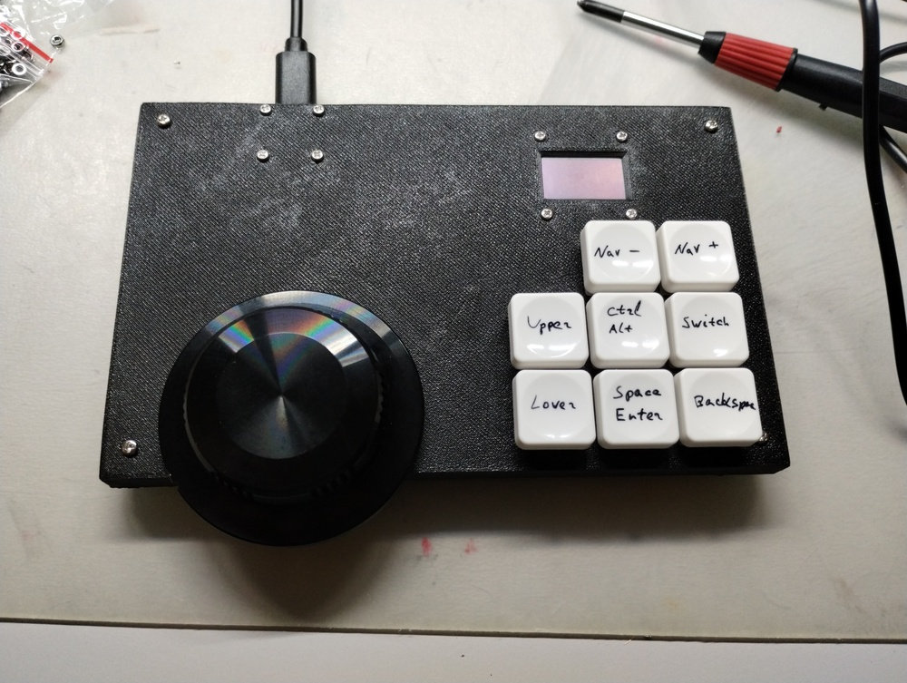
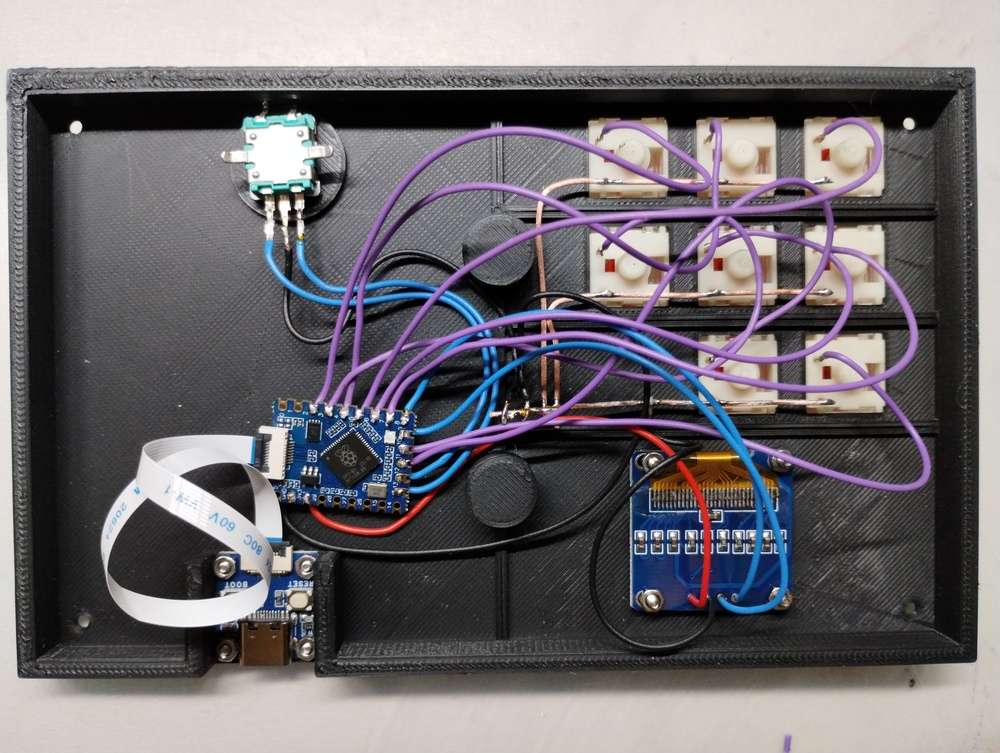
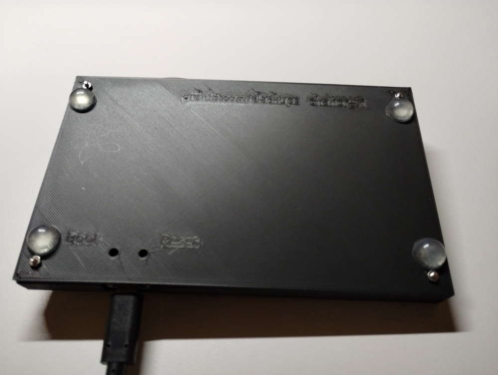

Chahor, an experimental keyboard for a user with cerebral palsy
===============================================================

This is an experimental keyboard aiming to improve the typing speed
for a PC user with cerebral palsy.

Requirements:

* one keypress at a time, one working hand;

* keys located compactly, reducing the need to move the hand;

* fully compatible PC keyboard, no additional software on the computer.

How it works:

The user chooses a letter from a layer, either by rotating a rotary
encoder wheel, or by pressing the navigation buttons. Then, by
pressing one of the text entry keys, the required symbol is sent to
the computer.

A small OLED screen shows the current letter or symbol that is ready
to send to the computer.

The keyboard has currently 4 symbol layers:

* English alphabet;

* Ukrainian alphabet;

* Numbers and special symbols as they are located on a US-English
  keyboard (`1` and `!` on the first number key, `0` and `)` on the
  last one);

* Function keys F1 to F12.


Six text entry keys are as follows:

* lower-case letter (or a number in the numeric layer);

* upper-case letter (or a symbol in the numeric layer);

* spacebar (on a long press, it works as the Enter key);

* backspace;

* Ctrl (on a long press, it works as Alt key);

* switch between layers.


The two navigation keys complement the rotary encoder and allow moving
forward and back along the alphabet. On a long press, the alphabet is
scrolled automatically at 3 letters per second.


Switching between languages
---------------------------

The firmware is preprogrammed to send the following combinations to
the host for language switching:

* US English: `Ctrl+Shift+1`
* Ukrainian:  `Ctrl+Shift+4`

These combinations are easy to set in Windows language preferences.

In Ubuntu, a Gnome extension called Shyriiwook needs to be installed:

```
git clone https://github.com/madhead/shyriiwook.git
cd shyriiwook
make install
gnome-extensions enable shyriiwook@madhead.me
```

After the extension is installed and activated, it should show the list of available keyboarrd layouts:

```
$ gdbus introspect --session --dest org.gnome.Shell --object-path /me/madhead/Shyriiwook --only-properties
node /me/madhead/Shyriiwook {
  interface me.madhead.Shyriiwook {
    properties:
      readonly as availableLayouts = ['us', 'ua'];
      readonly s currentLayout = 'us';
  };
};
```

The following two commands would activate the Ukrainian and US layouts, correspondinigly:

```
gdbus call --session --dest org.gnome.Shell --object-path /me/madhead/Shyriiwook --method me.madhead.Shyriiwook.activate "ua"

gdbus call --session --dest org.gnome.Shell --object-path /me/madhead/Shyriiwook --method me.madhead.Shyriiwook.activate "us"
```

Once it works, you can assign keyboard shortcuts to execute these
commands. In Settings -> Keyboard -> Keyboard Shortcuts -> Custom
Shortcuts, define the shortcuts as indicated above, to execute the
Gnome extension calls.


Firmware
--------

The firmawe is tested with RP2040, using Waveshare RP2040-Tiny for
production, and RP2040 Pico for development.

The firmware is written in Rust and it needs the following preparation
steps. The following instructions are suitable for ubuntu or Debian.

Environment preparation:

```
# the firmware build user needs to belong to the plugdev group in
# order to be able to upload the firmware to the board.
sudo usermod -aG plugdev $LOGNAME

# pre-requisites for building the firmware:
sudo apt-get install -y git build-essential

# install probe-rs udev rules
sudo wget https://probe.rs/files/69-probe-rs.rules -o /etc/udev/rules.d/69-probe-rs.rules
sudo udevadm control --reload
# if the debugger is already conneected to a USB port, re-initialize udev:
sudo udevadm trigger

# Follow the instructions at https://rustup.rs/ and install Rust:
curl --proto '=https' --tlsv1.2 -sSf https://sh.rustup.rs | sh

# re-login so that environment variables and plugdev group membership take effect

# Add the rp2040 compiler support:
rustup target add thumbv6m-none-eabi

# install probe-rs (only if debugger board is used)
curl --proto '=https' --tlsv1.2 -LsSf https://github.com/probe-rs/probe-rs/releases/latest/download/probe-rs-tools-installer.sh | sh

# install cargo-make
cargo install cargo-make

# get the firmware code
git clone https://github.com/clackups/chahor_rotary_keyboard.git
cd chahor_rotary_keyboard/firmware/
```

If you need to develop and debug the firmware, it is recommended to
use two RP2040 Pico boards: one will run the Chahor firmware, and the
other will be used as a debug probe. See the [instructions for the
probe](https://www.raspberrypi.com/documentation/microcontrollers/debug-probe.html)
for more details.

With the debugger connected, use the following commands to compile and upload the firmware:

```
# compile the firmware
cargo make build-dev

# compile and upload the firmware, using the debug board
cargo make run-dev
```

If you only need to upload a new version of the firmware, boot the
RP2040 board while the BOOT button is pressed, then

```
cargo make rr
```

If the load is successful, the keyboard is ready for work. You may
disconnect the debugger cable until you need to load the firmnmware
again.


Assembly
--------

Bill of material:

* [Waveshare RP2040-Tiny](https://www.waveshare.com/rp2040-tiny.htm)

* 8 low-profile MX keyboard switches

* 8 low-profile keyboard keycaps

* 24-pulse [rotary encoder by Adafruit](https://www.adafruit.com/product/377)

* 0.96" OLED screen with i2c interface by [Lilygo or the like](https://lilygo.cc/products/0-96-inch-oled)

* 8 M2*8mm screws and nuts

* 4 M2*16mm screws and nuts

* 0.9mm single-core copper wire

* connecting wires

* 4 round self-adhesive silicone bumpers, 12mm

3D printing models for the body and the bottom plate are [available in 3D_Print folder](3D_Print/), alongside with FreeCad models.

KiCad schematics source and the PDF are available in [KiCad folder](KiCad/).









## Copyright and license

This work is licensed under the MIT License.

Copyright (c) 2025 clackups@gmail.com

Fediverse: [@clackups@social.noleron.com](https://social.noleron.com/@clackups)
